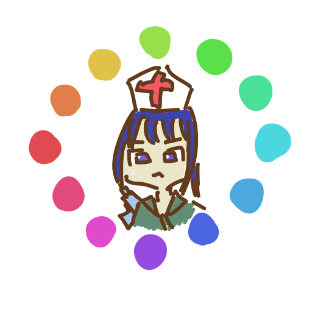

# Medicolor

**Medicolor** is a console tool to convert images color for simulation of color vision deficiency.

| Normal | Protanomaly | Deuteranomaly | Tritanomaly |
| -- | -- | -- | -- |
|  |  |  |  |

You can run Medicolor on Windows (x86, x64, arm64), macOS (x64, arm64) and Linux (x64, arm64).

<!--
## Installation

(To Be Write)
-->

## Acknowledgments

Super Thanks:

- [Paper: A Physiologically-based Model for Simulation of Color Vision Deficiency](https://www.inf.ufrgs.br/~oliveira/pubs_files/CVD_Simulation/CVD_Simulation.html)
